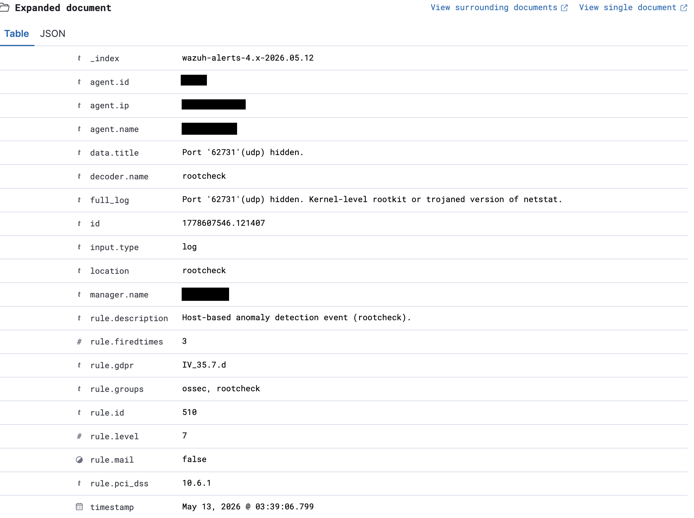
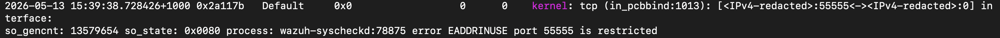
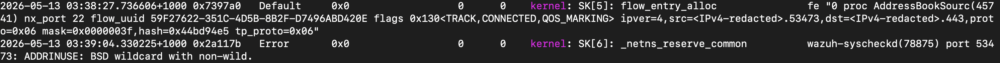

# Incident Response Report — IR-001 - Wazuh Rootcheck False Positive - macOS Agent

**Date:** 13/05/2026 

**Analyst:**  hsec-1

**Status:** Closed  

**Severity:** Informational

**Classification:** False Positive  

**Environment:** Personal device

---

## Summary

Wazuh alert triggered indicating potential active compromise with hidden ports and a kernel level rootkit or trojaned netstat. These alerts were triggered by the Wazuh rootcheck function. Rootcheck compares netstat ports in use with a manual binding attempt on all ports. The discrepancy between netstat and ports in use is what triggers the alert. The discrepancy is caused by ports in use by macOS that are not reported through netstat. These ports are either reserved or already bound but not reported through netstat.

---

## 1. Detection
**Detected By:** Wazuh alert

**Detection Time:** May 13, 2026 @ 03:39:06.799 

**Alert/Ticket ID:**  1778607546.121407

**Initial Indicator:** Alert


<br>




---

## 2. Timeline

|Date | Time | Event |
|---|---|---|
|13-05-2026 |10:00| Alerts checked |
|13-05-2026 |10:05| Investigation begins |
|13-05-2026 |10:30| Confirmed false positive |
|13-05-2026 |10:50| Detection rules altered |
|13-05-2026 |11:00| Documentation |
|13-05-2026 |13:00| Closed |

--- 

## 3. Investigation
a) Checked macOS System Integrity Protection status - returned 'enabled'. A real rootkit would likely disable.

b) Compared lsof against netstat - both matched, no hidden ports found during check. The ports in question (55555, 53473, 62731) were not open. 

c) Queried macOS kernel logs and checked for ports 55555 (entitlement restriction), 62731 (non-wildcard binding), and 53473 (non-wildcard binding) to find out what was bound to each port during the rootcheck bind attempts. Confirmed that ports 53473 and 62731 are reused by multiple apps.

All 3 of the above ports reported EADDRINUSE when Wazuh rootcheck ran and were not listed in netstat causing the alerts.

---

## 4. Root Cause
There seem to be two root causes creating these false positive alerts on this machine. Both are related to binding conflicts but with different root causes. 

Reason 1. 

macOS assigns some ports (in this case port 55555) entitlement restriction, when a port is entitlement restricted it appears as if it is in use when Wazuh's rootcheck function attempts to bind to it. macOS returns 'EADDRINUSE' which Wazuh interprets as in use. When it compares the ports available to bind to vs. the ports reported as in use by netstat there is an inconsistency, indicating a hidden port open.



<br>
<br>

Reason 2.

Non-wildcard binding conflict. macOS uses non-wildcard binding for some services - in this case AddressBookSourceAgent was bound to port 53473 when rootcheck attempted to bind. The AddressBookSourceAgent bind was not shown in netstat, causing the conflict and alert. Port 62731 has the same root cause, a service that is non-wildcard bound to the port at the time of the rootcheck bind attempt. 




---

## 5. Detection rule changes

New local rule has been implemented to reduce known false positive on port 55555. 

Added the following new rule to Wazuh local_rules.xml within the 'rootcheck' group. 

```
<rule id="100002" level="0"> 
    <if_sid>510</if_sid>  
    <match>Port '55555'(tcp) hidden</match> 
    <description>False positive: wazuh-syscheckd attempts to bind to macOS restricted port 55555 during rootcheck scan. Confirmed via kernel log. </description>
</rule>

```

False positives on other random ports, used for temporary connections by macOS will still trigger. This is a known limitation of this approach but has been selected as to not suppress potential genuine indicators.


--- 

## 6. Recommendations

Recommend setting a rule that triggers based on detection frequency on the same port over a set period of time, limited to high range ports(49152-65535), leaving lower range well known ports on standard detection rules. The idea behind this is to detect any ports that remain open but are genuinely hidden over a longer period of time which a threat actor could use for C2 or data exfiltration. 

---
