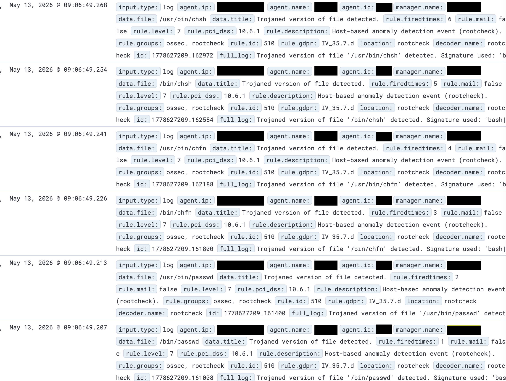
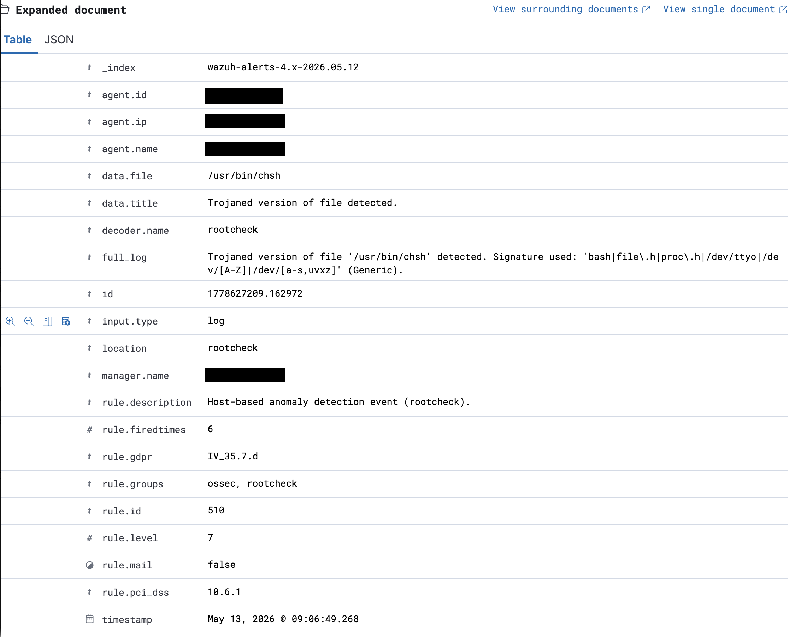

# Incident Response Report — IR-002 - Wazuh Rootcheck False Positive - Proxmox host

**Date:** 14/05/2026 

**Analyst:**  hsec-1

**Status:** Closed  

**Severity:** Informational

**Classification:** False Positive  

**Environment:** Homelab

---

## Summary

Wazuh alert triggered indicating potentially trojaned binaries on monitored proxmox host. Confirmed false positive - rootcheck signature matched '/dev/null' housed in legitimate binaries. 

---

## 1. Detection
**Detected By:** Wazuh alert

**Detection Time:** May 13, 2026 @ 09:06:49:207

**Alert/Ticket ID:**  1778627209.161008

**Initial Indicator:** Alert




<br>



---

## 2. Timeline

|Date | Time | Event |
|---|---|---|
|13-05-2026 |13:00| Alerts checked |
|13-05-2026 |13:05| Investigation begins |
|13-05-2026 |13:30| Confirmed false positive |
|13-05-2026 |13:50| Detection rules altered |
|14-05-2026 |13:00| Documentation |
|14-05-2026 |15:00| Closed |

--- 

## 3. Investigation
a) Checked 'passwd login' dpkg to verify file integrity

b) Confirmed both 'chsh' and 'chfn' belonged to 'passwd' package

c) confirmed '/bin/chsh' and '/bin/chfn' are symlinked to '/usr/bin/' 

d) Searched for strings that matched the rootcheck signature inside the flagged files. Could only find '/dev/null' which matched the '/dev/[a-s,uvxz]' with '/dev/n'.

These six alerts were triggered by three binary files that contain legitimate uses of '/dev/null' - the six alerts are triggered by the three files due to the symlink between '/usr/bin' and '/bin'. Confirmed false-positive. 

---

## 4. Root Cause
Rootcheck scans binaries for strings that match its library of known trojan signatures or in this case a pattern that matches the signature ('/dev/[a-s,uvxz]). Because the 'n' in '/dev/null' falls between 'a' and 's', the rule is triggered and alert created. The use of '/dev/null' is completely normal for removing unneeded data within Unix systems and benign. 


---

## 5. Detection rule changes

New local rules added to suppress alerts for these false positive trojan detections. 

```
<rule id="100003" level="0"> 
    <if_sid>510</if_sid>
    <field name="agent.name">proxmox host</field>
    <match>Trojaned version of file '/usr/bin/passwd'</match> 
    <description>False positive: Wazuh using detection for strings including '/dev/[a-s,uvxz] which is flagging files with '/dev/null' included. syscheck provides compensating control on suppressed alert. dpkg --verify confirmed binary legitimacy.</description>
</rule>
<rule id="100004" level="0"> 
    <if_sid>510</if_sid>
    <field name="agent.name">proxmox host</field>
    <match>Trojaned version of file '/usr/bin/chfn'</match> 
    <description>False positive: Wazuh using detection for strings including '/dev/[a-s,uvxz] which is flagging files with '/dev/null' included. syscheck provides compensating control on suppressed alert. dpkg --verify confirmed binary legitimacy.</description>
</rule>
<rule id="100005" level="0"> 
    <if_sid>510</if_sid>
    <field name="agent.name">proxmox host</field>
    <match>Trojaned version of file '/usr/bin/chsh'</match> 
    <description>False positive: Wazuh using detection for strings including '/dev/[a-s,uvxz] which is flagging files with '/dev/null' included. syscheck provides compensating control on suppressed alert. dpkg --verify confirmed binary legitimacy.</description>
</rule>
<rule id="100006" level="0"> 
    <if_sid>510</if_sid>
    <field name="agent.name">proxmox host</field>
    <match>Trojaned version of file '/bin/passwd'</match> 
    <description>False positive: Wazuh using detection for strings including '/dev/[a-s,uvxz] which is flagging files with '/dev/null' included. syscheck provides compensating control on suppressed alert. dpkg --verify confirmed binary legitimacy.</description>
</rule>
<rule id="100007" level="0"> 
    <if_sid>510</if_sid>
    <field name="agent.name">proxmox host</field>
    <match>Trojaned version of file '/bin/chfn'</match> 
    <description>False positive: Wazuh using detection for strings including '/dev/[a-s,uvxz] which is flagging files with '/dev/null' included. syscheck provides compensating control on suppressed alert. dpkg --verify confirmed binary legitimacy.</description>
</rule>
<rule id="100008" level="0"> 
    <if_sid>510</if_sid>
    <field name="agent.name">proxmox host</field>
    <match>Trojaned version of file '/bin/chsh'</match> 
    <description>False positive: Wazuh using detection for strings including '/dev/[a-s,uvxz] which is flagging files with '/dev/null' included. syscheck provides compensating control on suppressed alert. dpkg --verify confirmed binary legitimacy.</description>
</rule>
```

Decision to suppress is justified due to compensating control in syscheck which monitors '/usr/bin' for any tampering every 12 hours plus scans on start. 

---

## Skills Demonstrated

`Wazuh` `Rootcheck` `Linux` `Alert tuning` `Custom suppression rules` `False positive analysis` `Compensating controls`

---

[← Back to Incident Response](README.md) | [← Back to Portfolio](../README.md)

--- 
